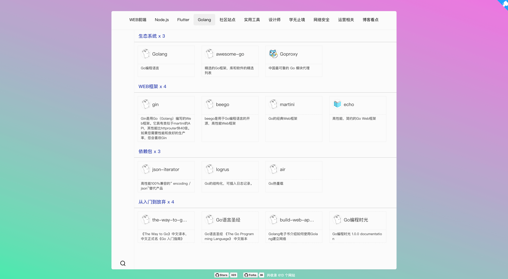

[](http://hits.dwyl.com/xjh22222228/nav)


## 发现导航是什么？
一个纯静态、易管理的强大导航网站，希望您喜欢它。


## 预览
[在线预览](https://xjh22222228.github.io/nav/index.html)





## 拥有出色的特性
- [√] 内置 `650+` 实用网站。
- [√] 三叉树分类、结构清晰、分类清晰。
- [√] 颜值与简约并存，不再是杀马特时代。
- [√] 支持3种浏览模式，创新。
- [√] 支持页面定位、滚动定位。
- [√] 支持移动端浏览。
- [√] 支持搜索查询。
- [√] 纯静态, 提供自动化部署功能。
- [√] 完全开源，轻松定制化。


## 贡献
[点击这里](https://github.com/xjh22222228/nav/tree/master/data)

Thank you for your [contribution](https://github.com/xjh22222228/nav/issues), men.

<a href="https://github.com/YutHelloWorld">
  
</a>
<a href="https://github.com/JJJTHuang">
  
</a>
<a href="https://github.com/Fechin">
  
</a>


## Build Setup
``` bash
# 下载
git clone --depth=1 https://github.com/xjh22222228/nav.git

# 安装依赖
npm install

# 启动[可选]
npm start

# 打包
npm run build
```


## 如何部署？
我建议你使用 `github pages` 服务, 这样你就不需要提供服务器, 并且项目里自带了自动化部署服务，像数 `321` 一样简单。

1、Fork 当前项目。

2、[https://github.com/settings/tokens](https://github.com/settings/tokens) 申请 token。

3、到 https://github.com/你的名字/nav/settings/secrets/new  添加刚刚申请的token， name填写 `TOKEN`。

4、当推送内容到仓库后会自动部署， 打开 https://你的名字.github.io/nav  即可看到。

5、打开 https://你的名字.github.io/nav 就能看到一个非常强大的导航网站了。


注：如果你想部署到自己的域名，那么以上教程同样适合，因为它提供了自动化更新， 之后你可以通过 `CNAME` 或 `反向代理` 实现。


## 更新数据
只需要关注根目录 `data` 文件夹, 如果你使用了上面教程提供的自动化部署服务，那么当更新数据后大概5分钟即可看到。


## 配置文件
`config/index.ts`, 你可以对默认的 中文 、 英文 、 Github 进行修改。


## 关于图标
项目中有一部分是使用本地图标，但我建议你直接使用网络图标，方便管理。


## 建议
如果有任何功能上的建议可通过 [issue](https://github.com/xjh22222228/nav/issues) 发起, Thank you.


## 支持开源


## License
[MIT](https://opensource.org/licenses/MIT)
